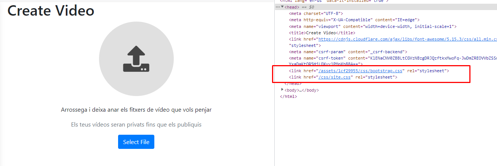
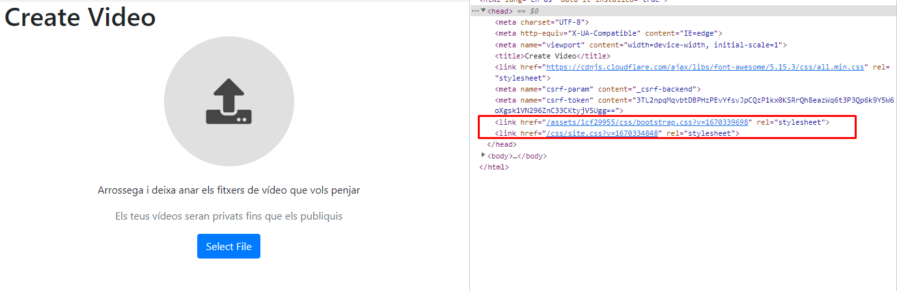
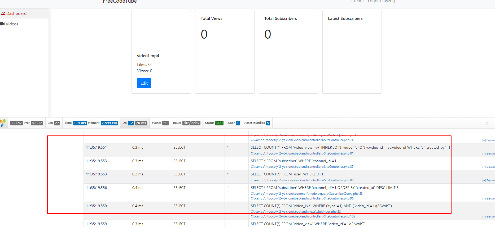
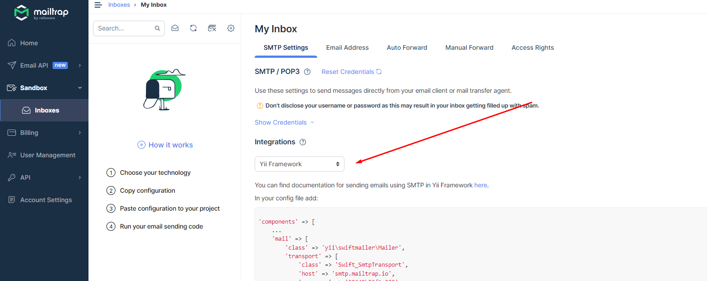

# Content

Font : https://www.youtube.com/watch?v=whuIf33v2Ug

## :rocket: INSTALL NECESSARY TOOLS

1) Xampp ([click](https://www.apachefriends.org/index.html)).
2) Composer ([click](https://getcomposer.org/download/)).

### Install XAMPP

```bash
# Per ficar-ho a WLS ha fet falta descargar-ho així!
sudo wget https://sourceforge.net/projects/xampp/files/XAMPP%20Linux/8.1.6/xampp-linux-x64-8.1.6-0-installer.run

sudo chmod 755 [package_name]
sudo ./[package_name]

# Run
sudo /opt/lampp/lampp start
```

### Install Composer

```
sudo apt install wget php-cli php-zip unzip
wget -O composer-setup.php https://getcomposer.org/installer
sudo php composer-setup.php --install-dir=/usr/local/bin --filename=composer
sudo composer self-update 
```

## :gear: PROJECT SETUP

### Install Advance project template

`Advance project template` ([www.yiiframework.com](https://www.yiiframework.com/extension/yiisoft/yii2-app-advanced/doc/guide/2.0/en), [github.com/yiisoft](https://github.com/yiisoft/yii2-app-advanced/blob/master/docs/guide/README.md)) using  `Composer`

```bash
composer create-project --prefer-dist yiisoft/yii2-app-advanced yii-application
```

### Config htdocs
Font: ([click](https://www.yiiframework.com/extension/yiisoft/yii2-app-advanced/doc/guide/2.0/en/start-installation)).

#### Config vhost
Domains:
- http://freecodetube.test/ 
- http://studio.freecodetube.test/

```bash
# add vhost in /opt/lampp/etc/extra/httpd-vhosts.conf (linux)
```
<details>
    <summary>For linux</summary>

```
<VirtualHost *:80>
    ServerName freecodetube.test
    DocumentRoot "/opt/lampp/htdocs/yii2-yt-clone/frontend/web/"
        
    <Directory "/opt/lampp/htdocs/yii2-yt-clone/frontend/web/">
        # use mod_rewrite for pretty URL support
        RewriteEngine on
        # If a directory or a file exists, use the request directly
        RewriteCond %{REQUEST_FILENAME} !-f
        RewriteCond %{REQUEST_FILENAME} !-d
        # Otherwise forward the request to index.php
        RewriteRule . index.php

        # use index.php as index file
        DirectoryIndex index.php

        # ...other settings...
        # Apache 2.4
        Require all granted
            
        ## Apache 2.2
        # Order allow,deny
        # Allow from all
    </Directory>
</VirtualHost>
    
<VirtualHost *:80>
    ServerName studio.freecodetube.test
    DocumentRoot "/opt/lampp/htdocs/yii2-yt-clone/backend/web/"
        
    <Directory "/opt/lampp/htdocs/yii2-yt-clone/backend/web/">
        # use mod_rewrite for pretty URL support
        RewriteEngine on
        # If a directory or a file exists, use the request directly
        RewriteCond %{REQUEST_FILENAME} !-f
        RewriteCond %{REQUEST_FILENAME} !-d
        # Otherwise forward the request to index.php
        RewriteRule . index.php

        # use index.php as index file
        DirectoryIndex index.php

        # ...other settings...
        # Apache 2.4
        Require all granted
            
        ## Apache 2.2
        # Order allow,deny
        # Allow from all
    </Directory>
</VirtualHost>
```

</details>

<details>
    <summary>For windows</summary>

```
    <VirtualHost *:80>
        ServerName freecodetube.test
        DocumentRoot "C:\xampp\htdocs/yii2-yt-clone\frontend\web"
            
        <Directory "C:\xampp\htdocs/yii2-yt-clone\frontend\web">
            # use mod_rewrite for pretty URL support
            RewriteEngine on
            # If a directory or a file exists, use the request directly
            RewriteCond %{REQUEST_FILENAME} !-f
            RewriteCond %{REQUEST_FILENAME} !-d
            # Otherwise forward the request to index.php
            RewriteRule . index.php

            # use index.php as index file
            DirectoryIndex index.php

            # ...other settings...
            # Apache 2.4
            Require all granted
                
            ## Apache 2.2
            # Order allow,deny
            # Allow from all
        </Directory>
    </VirtualHost>
        
    <VirtualHost *:80>
        ServerName studio.freecodetube.test
        DocumentRoot "C:\xampp\htdocs/yii2-yt-clone\backend\web"
            
        <Directory "C:\xampp\htdocs/yii2-yt-clone\frontend\web">
            # use mod_rewrite for pretty URL support
            RewriteEngine on
            # If a directory or a file exists, use the request directly
            RewriteCond %{REQUEST_FILENAME} !-f
            RewriteCond %{REQUEST_FILENAME} !-d
            # Otherwise forward the request to index.php
            RewriteRule . index.php

            # use index.php as index file
            DirectoryIndex index.php

            # ...other settings...
            # Apache 2.4
            Require all granted
                
            ## Apache 2.2
            # Order allow,deny
            # Allow from all
        </Directory>
    </VirtualHost>
```

</details>


### Config file hosts


```bash
# sudo nano /etc/hosts
127.0.0.1   freecodetube.test
127.0.0.1   studio.freecodetube.test
```

Jugant amb windows i wls:

:warning: No acabo de aconseguir que `freecodetube.test` i `studio.freecodetube.test` apuntin on toca. PLAN B (TEMPORAL): xampp de windows.
```bash
# c:\windows\system32\drivers\etc\hosts
127.0.0.1	freecodetube.test 
127.0.0.1	studio.freecodetube.test
::1	freecodetube.test studio.freecodetube.test localhost

# no tocar: /etc/hosts
```


### php init

```bash
# from project

# In linux
/opt/lampp/bin/php init

# In windows
C:\xampp\php\php init
```

## :pick: CREATE DB AND RUN SCRIPT MIGRATION
1) crear db (phpmyadmin). dbname: `yii2advanced`
2) migrate
    ```bash
    /opt/lampp/htdocs/yii2-yt-clone$ sudo /opt/lampp/bin/php yii migrate
    # special file – contains the all change of db.
    ```

## :man::woman: SIGN UP – ACTIVATE ACCOUNT AND LOGIN

1) Do sign-up
2) Go to frontendd/runtime/mail
3) Look a file!

    look this strange path:
    `http:/=
    /freecodetube.test/index.php?r=3Dsite%2Fverify-email&token=3D-q68Eli_TGK4I7=
    kNN5LGGbEpyH3Ais4t_1627751447`

    repare:
    `http://freecodetube.test/index.php?r=site%2Fverify-email&token=-q68Eli_TGK4I7kNN5LGGbEpyH3Ais4t_1627751447`

    Result: 
    `Your email has been confirmed!`

4) Go to browse!

## Change URL format

Ugly: `studio.freecodetube.test/index.php?r=site%2Findex`

Good: `http://freecodetube.test/site/login`

### Descomentar urlManager
- backend/main.php
- frontend/main.php

## EXPLORE PROJECT STRUCTURE 6 ENTRY SCRIPT
...

## CONFIG FILES
...

## CONTROLLERS & ACTIONS
...

## VIEWS
index.php (front) (back)

common conte els documents que utilitzen tant back com front.

Created application instance … app($config).run()

:warning: Estandard, dins de views tenim per exemple la carpeta `site` que fa referencia al controlador `SideController`.

## INSTALL BOOTSTRAP 4
## ASSET BUNDLES

```
composer require yiisoft/yii2-bootstrap4
```
```
composer remove yiisoft/yii2-bootstrap
``` 

registred all js and css class

## LAYOUTS
...

## APPLICATION PROPERTIES
...

## NAVBAR WIDGET
...

## COMPONENTS
...

## NAV WIDGET
...

## IDENTITY CLASS
...

## ACTIVE RECORD CLASS
...

## BEHAVIORS
...

## FINISH STUDIO LAYOUT
...

## URL CREATION
...

## MORE ON LAYOUTS
...

## FINISH STUDIO LAYOUT
...

## CREATE AUTH LAYOUT (NESTED LAYOUTS)
...

## ALIASES
...

## VIDEO TABLE MIGRATION

1) Run
    ```bash
    /opt/lampp/htdocs/yii2-yt-clone$ sudo /opt/lampp/bin/php yii migrate/create create_videos_table --fields="video_id:string(16):notNull,title:string(512):notNull,description:text(),created_by:interger(11):foreignKey(user)"
    ```
2) Anem a mirar el codi que s’ha generat  `console/migrations` I eliminem els errors. A mes aprofitem per fer canvis o afegir coses.

3) Apply changes
    ```bash
    /opt/lampp/htdocs/yii2-yt-clone$ sudo /opt/lampp/bin/php yii migrate
    ```
4) Revisem els canvis desde el `phpmyadmin` per exemple.
5) Revertir els canvis de l'última migracio
    ```
    /opt/lampp/htdocs/yii2-yt-clone$ sudo /opt/lampp/bin/php yii migrate/drown
    ```

## GENERATE VIDEO MODEL USING GII

Go to: `http://studio.freecodetube.test/gii/model`.

- Namespace: `common\models`
- Use Table Prefix.
- Generate ActiveQuery
- ActiveQuery Namespace: `common\models\query`.
- ActiveQuery Class: `ReplaceQuery`

## ACTIVE RECORD 6 MODELS
...

## MODEL RULES
...

## GENERATE VIDEO CRUD USING GII

Go to: `http://studio.freecodetube.test/gii/crud`.

-  Model Class `common\models\Video`
- Controller Class `backend\controlers\VideoController`
- View Path `@backend/views/video`

## VIDEO CREATE PAGE (WORKING WITH FORMS)

Put in layout: 
```html
<link href="https://cdnjs.cloudflare.com/ajax/libs/font-awesome/5.15.3/css/all.min.css" rel="stylesheet">
```

Afegim a `main.php` per evitar que cada vegada que l'usuari fa F5, es carreguin tots els documents css (si no hi han canvis, ja tenim la versió a cache)

```php
        'assetManager' => [
            'appendTimestamp' => true
        ]
```
Without Cache: 


With Cache: 


## VIDEO UPLOAD

Create `backend\web\app.js`

:warning: Tip to debug in php Controller:
```php
echo `<pre>`;
var_dump($my_var)
echo `</pre>`;
exit;
```

Per guardar el que ens envia el form fa: 
- Crea una variable publica `$video` al model `Video` per guardar el que rebem.
- Sobreescriu el mètode `save` del model `Video`. 

Algunes coses guais que fa servir:
```php
    Yii::$app->security->generateRandomString(8)
    FileHelper::createDirectory(dirname($videoPath))
```

:warning: Els vídeos estàn guardats en `frontend/web/storage/videos`

## VIDEO PAGE

Afegim el mètode `behaviors` al model `Video`:
```php
public function behaviors()
{
    return [
        // created_at - updated_at
        // When this attach to the model, 
        // automaticaly manage this attributes
        TimestampBehavior::class,
        [
            // El mateix però pels atributs:
            // created_by - updated_by
            'class' => BlameableBehavior::class,
            'updatedByAttribute' => false 
        ]
    ];
}
```
Elimina del `formulari` els camps per entrar el `created_by` and company ja que ha afegit el codi anterior.


Crea dues variables en el model `Video` i aprofita aqueste per modificar les `rules` afegint:
```php
['status', 'default', 'value' => self::STATUS_UNLISTED],
['has_thumbnail', 'deefault', 'value' => 0]
```

Add method `getVideoLink()` in model `Video`. :warning: Not hardcoded!

Afegim a `common\params-local.php`:
```php
<?php
return [
    'frontendUrl' => 'http://frecodetube.test'
];

```

Get Embed Responsive from bootstrap:
```
https://getbootstrap.com/docs/4.0/utilities/embed/
```

## VIDEO STATUS CHANGE

Add method `getStatusLabels()`.

## THUMBNAIL UPLOAD

Get `input-group/#custom-file-input` from `bootstrap`

Add public property `thumbnail` to model `Video`.

## THUMBNAIL RESIZE

Install:
```
composer require yiisoft/yii2-imagine
```

Add Rule to model `Video`:

```php
['thumbnail', 'image', 'minWith' => 3000]
```
S'aplica el validador `ImageValidator`.

Com retallem l'imatge:
```php
Image:getImagine()
    ->open($thumbnailPath)
    ->thumbnail(new Box(1200, 1280))
    ->save();
```

## HANDLE UPLOAD ERRORS

Add rule:
```php
['video', 'file', 'extensions' => ['mp4']]
```

## SAVE VIDEO TAGS
Google: ”bootstrap 4 tags input”

- Visit: https://www.jqueryscript.net/form/Bootstrap-4-Tag-Input-Plugin-jQuery.html
- Download
- Create in `backend\web\tabimput`
- And paste `.js` and `.css`.
- Create file `TagsInputAsset.php` in `backend\assets`
- extends to `AssetBundle`
- add: 
    ```php
    <?php

    namespace backend\assets;

    use yii\web\AssetBundle;
    use yii\web\JqueryAsset;

    class TagsInputAsset extends AssetBundle
    {
        public $basePath = '@webroot/tagsinput';
        public $baseUrl = '@web/tagsinput';
        public $css = [
            'tagsinput.css',
        ];
        public $js = [
            'tagsinput.js'
        ];
        public $depends = [
            JqueryAsset::class
        ];
    }
    ```

- Go to `_form.php` and add:
     ```php
    \backend\assets\TagsInputAsset::register($this);
    ```

## VIDEO LISTING PAGE (GRIDVIEW 6 DATA PROVIDERS)

Estem tocant el que volen i el que no en el llistat.

Creem per el camp video_id un nou component (on es mostrarà el vídeo).
El nou component: `_video_item` 

Anem a `bootstrap` a per un `components\media-object`.

Coses guais que fa servir: 
```php
StringHelper::truncateWords($model->description, 10)
```

Use for redirect when user click the video:
```php
Url::to(...)
```

## RESTRICT UPLOAD FOR AUTHORIZED USERS ONLY

Go to `VideoController` and add in `behaviors`:
```php
    # Nomès serà possible fer accions d'aquest controler si l'usuari està autoritzat (ha iniciat sessió)
    'access' => [
        'class' => AccessControl::class,
        'rules' => [
            [
                'allow' => true,
                'roles' => ['@'] #authorize
            ]
        ]
    ],
```

## IMPLEMENT FRONTEND LAYOUT
Tenim que evitar que un usuari pugui veure els videos d’un altre :)

Afegim en el `actionIndex` un filtre en el provider per retornar *els videos que ha creat l'usuari que està utilitzant la plataforma*.

```php
// millor utilitzar el andWhere que el where perquè si una subquery l'utilitza, peta!
Video::find()
    ->andWhere(['created_by' => Yii::$app->user->id])
```
Afegim en la classe `VideoQuery` per simplificar la crida anterior:
```php
public function creator($userId)
{
    return $this->andWhere(['created_by' => $userId])
}

Video::find()->creator(Yii::$app->user->id)

```

Afegim a més:
```php
public function latest()
{
    return $this->orderBy(['created_at' => SORT_DESC])
}
```

:warning: Per analitzar les crides que es fan i optimitzar podem veure el log desde el debug del yii:



Explicació de `ActiveDataProvider` extends `BaseDataProvider`.

En `BaseDataProvider` tenim:
- public $id;
- private $_sort;
- private $_pagination;
- private $_keys;
- private $_models;
- private $_totalCount;

## VIDEO DELETE

Add `ActionColumn` for to delete buttom.

Afegim tota la lògica

Afegim el mètode `afterDelete` en el model `Video`.
```php
public function afterDelete()
{
    parent::afterDelete();
    $videoPath = Yii::getAlias('@frontend/web/storage/videos/' . $this->video_id . '.mp4');
    unlink($videoPath); // remove a file

    $thumbnailPath = Yii::getAlias('@frontend/web/storage/thumbs/' . $this->video_id . '.jpg');
    if (file_exists($thumbnailPath)) {
        unlink($thumbnailPath); // remove a file
    }
}
```

## OUTPUT PUBLISHER VIDEOS ON FRONTEND

Create `frontend\controllers\VideoController.php`.
- Afegim l'acció Index
- Redefinit el path "inicial" com a `video/index`
- En el provider de l'acció filtrem els videos publicats (no ens interessa mostrar els que no estàn publicats).

Create a `frontent\views\index.php`
- Afegim el Widget: `Listview`.

Create a `video_item.php`.
- Anem a `bootstrap` a per el component `Card`.

## VIDEO VIEW PAGE

- Add `anchor link` to the video view + Url::to(...)
- Afegim `actionView`
- Creem el document `view.php`

:warning: Canvia el l'ayout desde la propia acció per amagar el meu lateral.

- Anem a per icones a `www.fontawesome.com/icons` per el `like` i `dislike`.

## COUNT VIDEO VIEWS

:warning: We need a table:

```bash
/opt/lampp/htdocs/yii2-yt-clone$ sudo /opt/lampp/bin/php yii migrate/create create_video_view_table --fields="video_id:string(16):notNull:foreignKey(video),user_id:integer(11):foreignKey(user), created_at(11)"
```

:warning: We need create the model using `gii`.

Create method:
```php
public function getViews() {
    return $this->hasMany(...);
}

$model->getViews()->count();
```

## IMPLEMENT LIKE/DISLIKE

:warning: We need a table:

```bash
sudo /opt/lampp/bin/php yii migrate/create create_video_like_table –fields="video_id:string(16):notNull:foreignKey(video), user_id:integer(11):notNull:foreignKey(user),type:integer(1),created_at:integer(11)"
```

:warning: We need create the model using `gii`.

Implement actions `video/like` and `video/dislike`.

Add in `behaviors` 
- access, *'only' => ['like', 'dislike']* and *auth*.
- verbs, like and dislike --> post

S'implementa amb `Pjax`.

Separar el codi en `_buttons.php`.

Afegim les constants a VideoLike. Dislike = 0, Like = 1;

En acabar el save volem retornar els buttons. :warning: 
```php
...
return $this->renderAjaz('_buttons', [
    'model' => $video
]);
```

Evitar que l'acció `actionLike` crei mes d'una entrada si l'usuari ja ha fet like. Podem tenir una entrada de tipus "like" or "dislike".

Afegim en el butoon les classes en funció de si *l'usuari ha donat like o no*. Es mostrarà el botó like blau o el dislike.

Creem el mètode `getLikes()` per treure el numero de likes hardcoded.

Add property `VideoLike[] $likes` in model `Video`. Same for dislike.

## CHANNEL PAGE

Per mostrar el nom utilitza: `$model->createdBy->username`.

Create `ChannelController`. Create `actionView`.

Create `views\channel\view.php`.

Add rules `'/c/<username>' => '/channel/view'`.

In `video\view.php` create `anchor link` with username.

Anem a ``bootstrap` a per `components/jumbotron`.

Anem a per una `bell button` per `subscribe`.

## SUBSCRIBE / UNSUBSCRIBE

:warning: We need a table:
```php
sudo /opt/lampp/bin/php yii migrate/create create_subscriber_table --fields="channel_id:integer(11):foreignKey(user),user_id:integer(11):foreignKey(user),created_at:integer(11)"
```

:notebook: Practicament el mateix procediment que en el punt del like/dislike.

## MANY TO MANY RELATIONS

```php
    /**
     * @return \yii\db\ActiveQuery
     * @throws \yii\base\InvalidConfigException
     */
    public function getSubscribers()
    {
        return $this->hasMany(User::class, ['id' => 'user_id'])
            ->viaTable('subscriber', ['channel_id' => 'id']);
    }
```

## OUTPUT VIDEOS ON CHANNEL PAGE

:warning: Create helper to obtain channelLink more easy:
```php
<?php

namespace common\helpers;

use yii\helpers\Url;

class Html
{
    public static function channelLink($user, $schema = false)
    {
        return \yii\helpers\Html::a(
            $user->username,
            Url::to(['/channel/view', 'username' => $user->username],$schema),
            ['class' => 'text-dark']
        );
    }
}

// Use in view
<?php echo \common\helpers\Html::channelLink($model->createdBy) ?>
```

## EMAIL SEND USING MAILTRAP

Fake email: https://mailtrap.io

Go to:



And paste in `main-local.php`:

```php
    'mailer' => [
        'class' => 'yii\swiftmailer\Mailer',
        'viewPath' => '@common/mail',
        'transport' => [
            'class' => 'Swift_SmtpTransport',
            'host' => 'smtp.mailtrap.io',
            'username' => '********',
            'password' => '********',
            'port' => '2525',
            'encryption' => 'tls',
        ],
    ],
```

Add in `actionSubscribe`:
```php
    Yii::$app->mailer->compose([
        'html' => 'subscriber-html', 
        'text' => 'subscriber-text'
    ], [
        'channel' => $channel,
        'user' => \Yii::$app->user->identity
    ])
    ->setFrom(Yii::$app->params['senderEmail'])
    ->setTo($channel->email)
    ->setSubject('You have new subscriber')
    ->send();
```

Create two files in `common\mail`:
- `subscriber-html.php`
- `subscriber-text.php`


## SEARCH
/opt/lampp/bin/php yii migrate/create create_fulltext_index_on_video

/opt/lampp/bin/php yii migrate

## SIMILAR VIDEOS

## HISTORY PAGE

Fixat que la crida es complicadaa si no tenim el context al cap. Fem una join amb una TAULA VIRTUAL que representa els videos amb les seves dates maximes. Volem obtenir el historial  ...

## IMPLEMENT DASHBOARD

## DEBUG BAR
Un detall d’eficiencia: 
es fan dues crides molt semblants per els diferents usuaris ...

es podrueix perque iterem els objectes subscription i fem -> user. Per poder fer el mateix pero evitant la crida en el moment d’obtenir els subscriptors hem de fer: 

## RELATION EAGER LOADING

## CACHING

## OVERVIEW, CODE CLEANUP AND IMPROVEMENTS